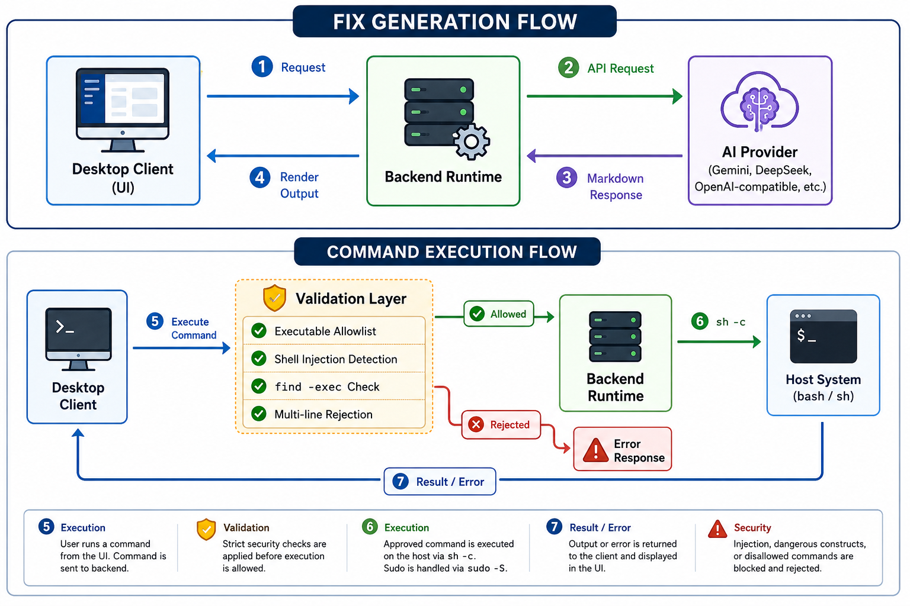

# AI Compliance Fixes & Remediation

The Wazuh Agent Status application integrates AI-powered remediation advice to help users resolve failed **Security Configuration Assessment (SCA)** compliance checks.

This document describes how the AI remediation feature works, its technical architecture, command execution mechanics, and security controls.

---

## 1. Overview of the Fix Workflow

When a compliance check fails (e.g., password expiration policy, unused services enabled), the UI offers a **"Fix with AI"** option.



### Fix Generation Flow

1. **AI Fix Suggestion**: The frontend sends check metadata (title, category, remediation guidelines, target OS) to the backend runtime.
2. **API Request**: The backend forwards the request to the configured AI Provider (Gemini, DeepSeek, OpenAI-compatible endpoint, etc.).
3. **Markdown Reply**: The AI returns a detailed remediation plan in Markdown.
4. **Parsing & Rendering**: The frontend parses the markdown to isolate risk levels, impact analysis, description text, and executable commands. Results are displayed as interactive terminal-style cards.

### Command Execution Flow

5. **Execution**: Users can run individual commands directly from the UI. Each command is sent to the backend for validation and execution. Sudo-requiring commands are handled via `sudo -S` (stdin-based password piping), and destructive or interactive commands are flagged with warnings.
6. **Security Validation**: Before any command reaches the host shell, it passes through a strict validation pipeline that checks against an allowlist, blocks injection patterns, and rejects dangerous constructs.

### Batch Fixes

Users can also trigger a **"Fix All Failed"** action. The backend sends each failed check as an independent prompt to the AI (with a short throttle between requests to avoid rate limits), collects all results, and returns them as a single aggregated response.

### SCA Rescan

To confirm the issue is fixed, users can trigger an immediate agent-level compliance scan from the UI. Since Wazuh does not expose a CLI endpoint to start an SCA scan on demand, the action restarts the local `wazuh-agent` service — with `<scan_on_start>yes</scan_on_start>` configured by default, the service restart forces a fresh compliance scan to run immediately.

---

## 2. Command Execution Mechanics

Executing terminal commands from an unprivileged desktop application requires careful shell session handling:

### Standard Command Execution

For standard (non-sudo) actions, the backend executes commands via a child process:

- On **Linux/macOS**: Invokes `sh -c "<command>"`.
- On **Windows**: Invokes `powershell.exe -NoProfile -NonInteractive -Command "<command>"`.

Stdout and stderr are captured and returned to the UI in real-time.

### Sudo Command Execution (`sudo -S`)

Many security remediations require root privileges. Standard `sudo <command>` calls wait for password input on `stderr`/`tty`, which causes UI applications to hang indefinitely.

To resolve this:

- The app requests the user's sudo password in the UI.
- The backend executes: `echo <password> | sudo -S -p '' <command>`.
- The `-S` flag forces `sudo` to read the password from standard input, and `-p ''` silences any custom password prompts, preventing execution hangs.

### Force SCA Rescan

The **"Trigger SCA Rescan"** action executes a service restart via:

```
echo <password> | sudo -S -p '' systemctl restart wazuh-agent
```

---

## 3. Security Controls & Architecture

Running shell commands suggested by an AI requires strict security boundaries to prevent malicious input execution or credential leaks.

### Password Privacy

- **RAM-Only State**: The user's sudo password exists only in the frontend's in-memory state (React component state). It is **never** written to disk, configuration files, cache, or logs.
- **Shared Session**: The password is shared across all execution steps within the same fix session. Once typed for one command, it auto-fills for others.
- **Wiped on Close**: When the fix modal is closed, the password state is immediately cleared from memory.
- **No AI Access**: The password is never sent to the AI API or transmitted over the network. It remains strictly local to the frontend and the backend IPC bridge.

### Interactive Editor Prevention

AI models occasionally suggest opening files in interactive CLI editors (e.g., `nano`, `vim`, `emacs`). Running these inside an automated shell child process will hang execution forever.

1. **Prompt Engineering**: The backend system prompt instructs the AI model to never suggest interactive tools, requiring scriptable equivalents instead (e.g., using `sed`, `tee`, `echo`, or file redirection).
2. **Frontend Interceptor**: The frontend scans every command against a regex pattern that detects interactive editors and viewers (`nano`, `vi`/`vim`, `emacs`, `gedit`, `kate`, `mousepad`, `xed`, `less`, `more`, `most`, `htop`, `top`, `man`, `watch`, interactive `tail -f`, and similar). If an interactive tool is detected, the **Execute** button is disabled and a warning banner advises the user to run the command manually in their system terminal.

### Command Validation & Allowlist

Every command received from the frontend is validated on the backend **before** it reaches the host shell. This is the primary security boundary — it does not rely on the frontend or AI provider being trustworthy.

1. **Executable Allowlist**: Only a predefined set of system administration tools are allowed. These cover file manipulation (`sed`, `awk`, `tee`, `chmod`, `chown`, `rm`), service management (`systemctl`, `service`, `sysctl`), user/group management (`usermod`, `passwd`, `chage`), package management (`apt`, `yum`, `dnf`), network diagnostics (`ip`, `ss`, `netstat`), and similar. Dangerous dispatchers (`sh`, `bash`, `python`, `env`, `nice`, `nohup`, `timeout`, `xargs`, `command`) are **explicitly excluded** to prevent allowlist bypass via sub-execution.

2. **Shell Injection Blocking**: Commands containing `$(...)` command substitution or backtick `` `...` `` substitution are rejected outright, as these bypass the allowlist by executing arbitrary shell expressions.

3. **Multi-Line Blocking**: Commands containing newlines are rejected. Newlines act as command separators in shell pipelines and could allow a second unvalidated command to execute.

4. **Shell Metacharacter Normalization**: Before parsing, the command string is normalized so that shell separators (`;`, `&&`, `||`, `|`) are always tokenized as distinct elements — even when written without surrounding spaces (e.g., `echo hello;curl`). This prevents an attacker from hiding a second command behind a separator that is adjacent to the previous token.

5. **`find -exec` Validation**: The `find` command can dispatch arbitrary executables via its `-exec` and `-execdir` flags, which would bypass top-level command extraction. When `find` is detected, the target of each `-exec`/`-execdir` flag is independently validated against the same allowlist.

### Defense in Depth

- **Backend is authoritative**: Validation runs on the backend; frontend warnings are strictly cosmetic and informational.
- **Hardcoded rescan command**: The SCA rescan uses a fixed, hardcoded command (`systemctl restart wazuh-agent`) that is never exposed to the AI or user input.
- **Prompt-level guards**: The system prompt instructs the AI to avoid dangerous patterns, providing an additional layer even though the backend does not rely on it.

---

## 4. Configuration

To enable AI remediation:

1. Navigate to the **Settings** tab in the Wazuh Agent Monitor app.
2. Configure the **AI provider** endpoint URL (e.g. Gemini, OpenAI, Anthropic, DeepSeek, or custom endpoint).
3. Provide the required **API Key** and **Model Name** (e.g., `deepseek-chat`, `gemini-1.5-flash`).
4. Click **Test Connection** to verify connectivity. Once saved, the "Fix with AI" buttons will activate on the Compliance tab.

> Note: The “Fix with AI” action is only displayed when at least one **SCA check** has failed.
