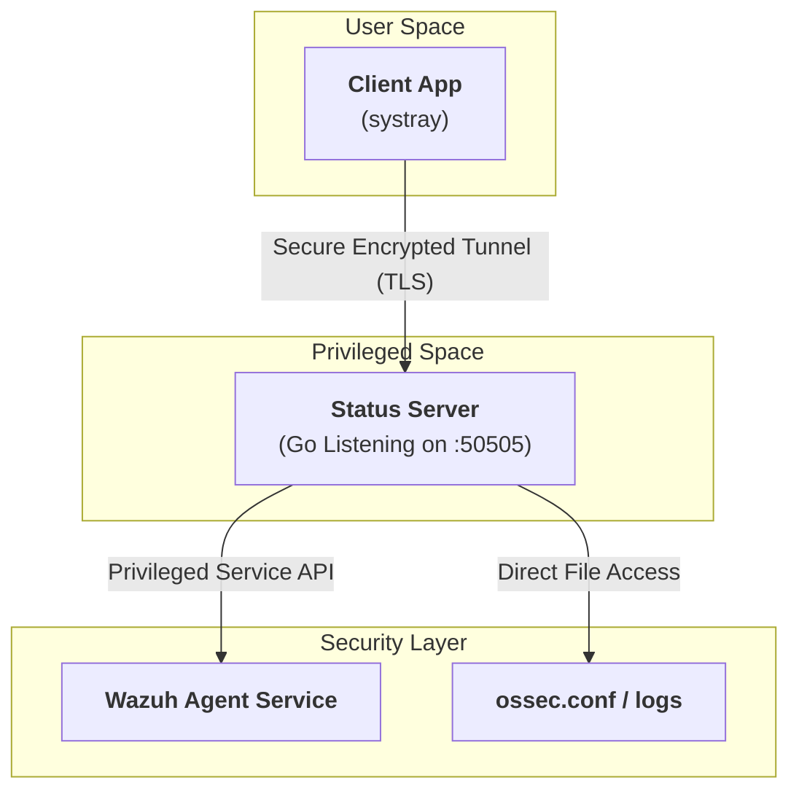
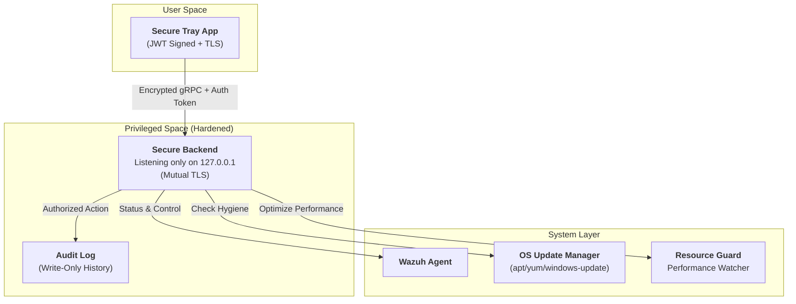

# 🏗️ Wazuh Agent Status: Architecture Overview

This document provides both a high-level conceptual overview and a professional-grade technical analysis of the system architecture.

---

## 🗺️ Conceptual Overview (The "Brains & Face" Analogy)

In simple terms, the application is split into two halves:

### 1. The Brains (The Server) — `wazuh-agent-status`

- **What it is**: A program that runs quietly in the background of your computer.
- **What it does**: It is the part that actually "talks" to the **Wazuh Agent** (the security tool we are monitoring). It checks if the agent is awake or asleep and can give it orders to restart or update.
- **Why we need it**: Computers need a dedicated service that has the "permission" to manage security tools safely.

### 2. The Face (The System Tray App) — `wazuh-agent-status-client`

- **What it is**: The little icon you see at the top or bottom of your screen (near the clock).
- **What it does**: It shows you a green or gray dot so you know at a glance if you are protected. It also gives you a menu with buttons like "Restart" or "Update."
- **Why we need it**: It makes the security tool "visible" and easy to control for anyone, without needing to type complex commands.

---

## 🛠️ Technical Architecture Diagram

---

## 🔒 The Future: Hardened & Enterprise Architecture

As we progress through the roadmap, the architecture will evolve into a "Hardened" state to meet enterprise security standards (like SOC2).

### ✅ Key Differences in the Hardened Version:

1.  **Mutual Authentication**: The "Face" and "Brains" must prove their identity to each other before any command is processed.
2.  **Encrypted Tunnel (mTLS)**: Even though both are on the same machine, wrapping the talk in a secure tunnel prevents other local malware from "listening in."
3.  **Strict Binding**: The server will only accept calls from "inside the house" (127.0.0.1), making it invisible to the rest of the network.
4.  **Audit Trail**: Every button click is recorded in a secure log, creating a "paper trail" for security auditors.
5.  **Proactive Guarding**: The **Resource Guard** continuously tracks system health (CPU/RAM) and can "auto-fix" processes that slow down the user's experience.

---

## 🚩 Security Deep-Dive & Marketing Value

To make this application "Enterprise-Ready" and marketable, we must address the following technical gaps found in the initial design.

| Technical Component | 🚩 Security Flaw (Current)                                  | 🛡️ Professional Mitigation (Roadmap)         | ✅ Marketable Benefit                                                                              |
| :------------------ | :---------------------------------------------------------- | :------------------------------------------- | :------------------------------------------------------------------------------------------------- |
| **Communication**   | Plaintext TCP on port 50505. Traffic is not encrypted.      | **TLS/SSL Encryption** wraps the connection. | Ensures **Data-in-Transit** privacy, a mandatory requirement for SOC2/HIPAA.                       |
| **Access Control**  | No authentication. Anyone on the machine can send commands. | **JWT / Token Authentication** handshake.    | Prevents unauthorized "Service Denial" where malware attempts to stop the security agent.          |
| **Surface Area**    | Default binding may expose the port to the network.         | **Strict Localhost Binding** (127.0.0.1).    | Follows the **Least Privilege** principle, ensuring the tool is invisible to the external network. |
| **Traceability**    | Commands are executed silently.                             | **Secure Audit Logging**.                    | Provides a "Paper Trail" for forensics, proving WHO touched the security settings and WHEN.        |

---

## 🔄 Interaction Flow

1.  **Status Request**: The **Client** sends a signed request to the **Server**.
2.  **Verification**: The **Server** checks the signature/token.
3.  **OS Check**: The **Server** queries the system (e.g., `systemctl` or Windows Registry) for the agent's real-time state.
4.  **Secure Response**: The **Server** sends an encrypted status packet back to the **Client**.
5.  **Visual Update**: The **Client** updates the tray icon accordingly.
