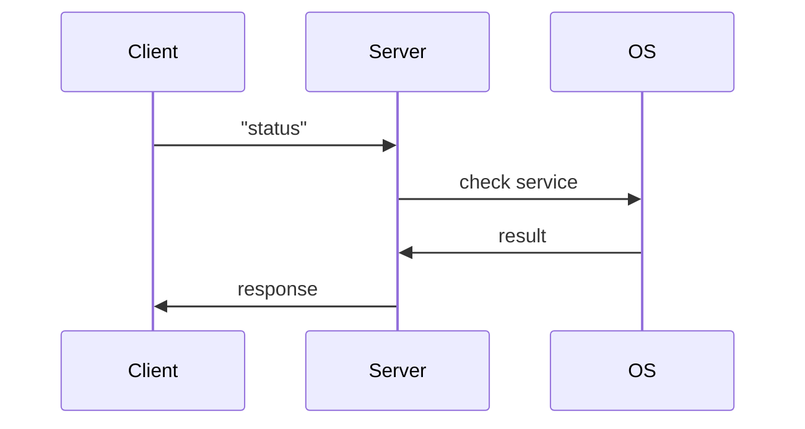

# 🔍 Current System Analysis — Go Implementation

## 1. Purpose

This document analyzes the current Go-based implementation to identify architectural limitations and technical debt.

---

## 2. Communication Model

- Protocol: TCP (localhost:50505)
- Format: Plaintext
- Pattern: Request/Response

---

## 3. Sequence Flow

---

## 4. Server Design

- Uses blocking TCP connections
- Command-based dispatch (switch-case)
- Executes OS commands via `exec`

### Issues:

- Inefficient process spawning
- No connection lifecycle control
- No authentication

---

## 5. Client Design

- Polls server every 5 seconds
- Uses goroutines for concurrency
- Minimal local state

### Issues:

- Constant polling overhead
- No push-based updates

---

## 6. Technical Debt

| Area            | Issue                           |
| --------------- | ------------------------------- |
| Security        | No encryption or authentication |
| Performance     | Frequent polling                |
| Maintainability | Tight coupling                  |
| Observability   | No logging/audit                |

---

## 📈 Baseline Performance Metrics (Go 1.8.x)

The following metrics were recorded on a standard Linux workstation:

### Tray Client (`wazuh-agent-status-client`)

- **Resident Set Size (RSS)**: ~10.1 MB
- **Virtual Size (VSZ)**: ~2.2 GB
- **Idle CPU Usage**: < 0.1%

### Status Server (`wazuh-agent-status`)

- **Resident Set Size (RSS)**: ~10.5 MB
- **Virtual Size (VSZ)**: ~1.9 GB
- **Idle CPU Usage**: < 0.1%

> **Note**: These metrics serve as the benchmark for Phase 1 (Client) and Phase 3 (Server) of the Rust migration. Our target is to reduce total RSS for both components to **< 3 MB combined**.

---

## 7. Key Limitations

- No secure communication
- Inefficient resource usage
- Not enterprise-ready

---
