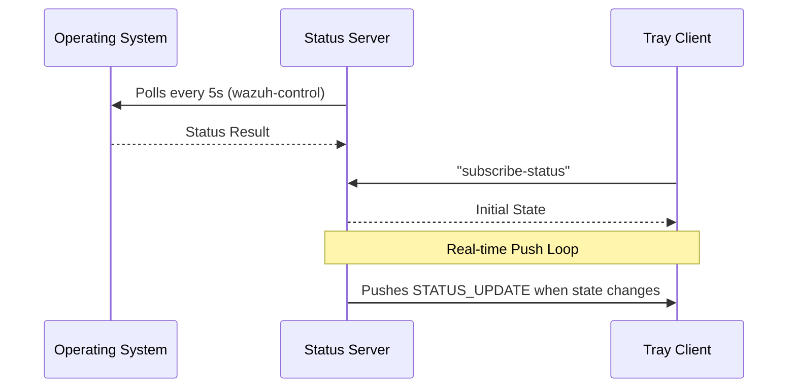

# 🔍 Current System Analysis — Go Implementation

## 1. Purpose

This document analyzes the current Go-based implementation to identify architectural limitations and technical debt.

---

## 2. Communication Model

- Protocol: TCP (localhost:50505)
- Format: Plaintext
- Pattern: Subscribe/Push (Status updates)

---

## 3. Sequence Flow

---

## 4. Server Design

- Uses blocking TCP connections (Go `net` package)
- Command-based dispatch (switch-case)
- **Platform-Specific Monitoring**:
  - **Windows**: Checks state via Service Manager (Scm).
  - **Linux / macOS**: Executes OS commands via `wazuh-control` binary.

### Issues:

- Inefficient process spawning
- No connection lifecycle control
- No authentication

---

## 5. Client Design

- Subscribes to backend via `subscribe-status`
- Uses a blocking read loop for real-time pushed updates
- Uses goroutines for concurrency
- Minimal local state

### Issues:

- Maintaining long-lived TCP connections without heartbeat (potential silent drops)
- Plaintext communication

---

## 6. Technical Debt

| Area            | Issue                           |
| --------------- | ------------------------------- |
| Security        | No encryption or authentication |
| Reliability     | No heartbeat/keep-alive         |
| Maintainability | Tight coupling                  |
| Deployment      | Go runtime/CGO overhead         |

---

## 📈 Baseline Performance Metrics (Go 1.8.x)

The following metrics were recorded on a standard Linux workstation:

### Tray Client (`wazuh-agent-status-client`)

- **Resident Set Size (RSS)**: ~10.1 MB
- **Virtual Size (VSZ)**: ~2.2 GB
- **Idle CPU Usage**: < 0.1%

### Status Server (`wazuh-agent-status`)

- **Resident Set Size (RSS)**: ~10.5 MB
- **Virtual Size (VSZ)**: ~1.9 GB
- **Idle CPU Usage**: < 0.1%

---

## 8. Logging Infrastructure

Both components maintain their own logs using the `lumberjack` rotation library.

| Platform    | Server Log Path                                    | Client Log Path                                      |
| ----------- | -------------------------------------------------- | ---------------------------------------------------- |
| **Linux**   | `/var/log/wazuh-agent-status.log`                  | `~/.wazuh/wazuh-agent-status-client.log`             |
| **macOS**   | `/var/log/wazuh-agent-status.log`                  | `~/.wazuh/wazuh-agent-status-client.log`             |
| **Windows** | `C:\ProgramData\wazuh\logs\wazuh-agent-status.log` | `%APPDATA%\wazuh\logs\wazuh-agent-status-client.log` |

---

## 9. Key Limitations

- No secure communication
- Inefficient resource usage
- Not enterprise-ready

---
