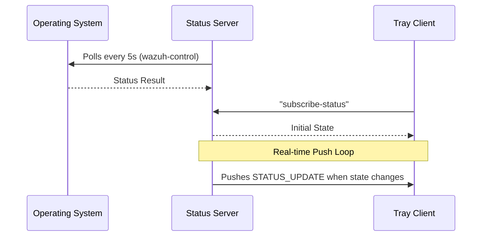

#  Historical System Analysis — Go Implementation (Archived)

> ** This document is for historical reference only.**
> The Go implementation has been fully removed from the repository as of v0.5.x.
> The system now uses Rust for both the server and client components.

## 1. Purpose

This document analyzes the previous Go-based implementation to identify architectural limitations and technical debt that motivated the Rust migration.

---

## 2. Communication Model (Historical)

- Protocol: TCP (localhost:50505)
- Format: Plaintext
- Pattern: Subscribe/Push (Status updates)

---

## 3. Sequence Flow (Historical)

```mermaid
sequenceDiagram
    participant OS as Operating System
    participant Server as Status Server
    participant Client as Tray Client

    Server->>OS: Polls every 5s (wazuh-control)
    OS-->>Server: Status Result
    Client->>Server: "subscribe-status"
    Server-->>Client: Initial State
    Note over Server,Client: Real-time Push Loop
    Server->>Client: Pushes STATUS_UPDATE when state changes
```

---

## 4. Server Design (Historical)

- Uses blocking TCP connections (Go `net` package)
- Command-based dispatch (switch-case)
- **Platform-Specific Monitoring**:
  - **Windows**: Checks state via Service Manager (Scm).
  - **Linux / macOS**: Executes OS commands via `wazuh-control` binary.

### Issues (Resolved by Rust migration):

- Inefficient process spawning
- No connection lifecycle control
- No authentication

---

## 5. Client Design (Historical)

- Subscribes to backend via `subscribe-status`
- Uses a blocking read loop for real-time pushed updates
- Uses goroutines for concurrency
- Minimal local state

### Issues (Resolved by Rust migration):

- Maintaining long-lived TCP connections without heartbeat (potential silent drops)
- Plaintext communication

---

## 6. Technical Debt (Resolved)

| Area            | Issue                           |
| --------------- | ------------------------------- |
| Security        | No encryption or authentication |
| Reliability     | No heartbeat/keep-alive         |
| Maintainability | Tight coupling                  |
| Deployment      | Go runtime/CGO overhead         |

---

##  Baseline Performance Metrics (Go 1.8.x)

The following metrics were recorded on a standard Linux workstation:

### Tray Client (`wazuh-agent-status-client`)

- **Resident Set Size (RSS)**: ~10.1 MB
- **Virtual Size (VSZ)**: ~2.2 GB
- **Idle CPU Usage**: < 0.1%

### Status Server (`wazuh-agent-status`)

- **Resident Set Size (RSS)**: ~10.5 MB
- **Virtual Size (VSZ)**: ~1.9 GB
- **Idle CPU Usage**: < 0.1%

---

## 7. Logging Infrastructure (Historical)

Both components maintained their own logs using the `lumberjack` rotation library.

| Platform    | Server Log Path                                        | Client Log Path                                         |
| ----------- | ------------------------------------------------------ | ------------------------------------------------------- |
| **Linux**   | `/var/log/wazuh-agent-status.log`                      | `~/.wazuh/wazuh-agent-status-client.log`                |
| **macOS**   | `/var/log/wazuh-agent-status.log`                      | `~/.wazuh/wazuh-agent-status-client.log`                |
| **Windows** | `C:\\ProgramData\\wazuh\\logs\\wazuh-agent-status.log` | `%APPDATA%\\wazuh\\logs\\wazuh-agent-status-client.log` |

---

## 8. Key Limitations (Now Resolved)

- No secure communication
- Inefficient resource usage
- Not enterprise-ready

The Rust implementation addresses all of these limitations with improved performance, security, and maintainability.
