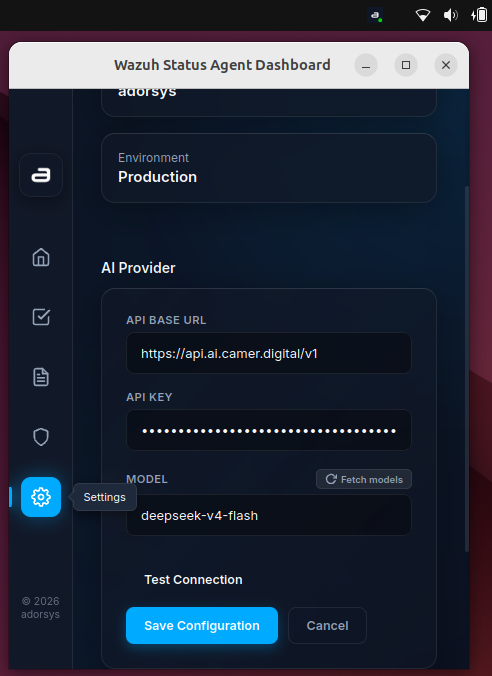
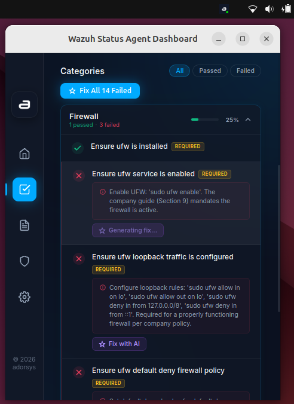
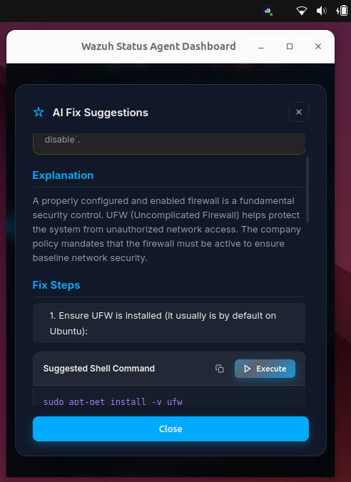

# AI-Powered Remediation

## Overview
AI-Powered Remediation automatically generates the exact terminal commands required to fix failed compliance checks, allowing you to secure your system rapidly without needing to look up complex configurations manually.

## How It Works
When you view a failed compliance check, the application sends the check's context (such as the policy description and the expected configuration) to an integrated AI model. The model returns a specific, safe command (e.g., a Bash or PowerShell script) to remediate the vulnerability.

> **ℹ️ Note**
>
> Always review AI-generated commands before executing them to ensure they align with your system's specific requirements.
{: .note }

## AI Configuration

Before you can use AI remediation, you need to configure your AI provider settings in the application.

1. Open the main dashboard from the system tray (**Show Dashboard**).
2. Navigate to the **Settings** or **AI Configuration** tab.
3. Configure the following fields:
   - **Provider Endpoint:** The URL of the AI provider (e.g., OpenAI API, a local Ollama endpoint, etc.).
   - **API Key:** Your secret API key for authenticating with the provider.
   - **Model Selection:** Choose or type in the model you wish to use (e.g., `gpt-4o`, `llama3`).
4. Save your configuration.

## Step-by-Step Guide

### 1. Select a Failed Check
- Open the [Compliance Dashboard](compliance-dashboard.md).
- Find and click on a failed compliance check (marked in red).

### 2. Generate Fix Command
- In the expanded details view, look for the **Remediation** section.
- Click the **Fix with AI** button. 
- Wait a few seconds while the AI analyzes the policy and generates the appropriate command for your specific operating system (Linux, macOS, or Windows).

### 3. Review the Command
The AI will present a terminal command. Carefully read the command and the accompanying explanation to understand what configuration files or registry keys it will modify.

### 4. Execute the Fix
- If you are satisfied with the command, click the **Execute** button.
- The application will run the command securely through the backend Rust server.
- Once completed, the output of the command (success or error) will be displayed.
- The Wazuh agent will verify the fix during its next scheduled SCA scan.
