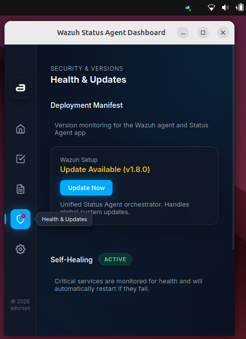

# Update Management

## Overview
The Update feature ensures your Wazuh Agent Status application stays secure and up to date. The application can automatically check for updates and notify you when a new version is available, allowing you to install it with a single click.

## How It Works
The client application periodically checks the official GitHub repository for new releases based on a version manifest file. When a new release is found (either stable or prerelease, depending on your agent's group configuration), it will notify you in the dashboard so you can choose to apply the update.

## Step-by-Step Guide

### 1. Manual Update Check
- Click (or right-click) the Wazuh Agent Status system tray icon.
- Click **Check for Updates**.
- If a new version is available, you will receive a notification in the main dashboard prompting you to install it.

### 2. Release Channels (Stable vs. Prerelease)
The desktop client does not have a manual toggle for release channels. Instead, the release channel is **centrally managed** via your Wazuh Manager.
- The application automatically reads the group assigned to your Wazuh agent.
- If your agent is assigned to a prerelease testing group (e.g., `beta` or `prerelease`) on the Wazuh Manager, the agent status UI will automatically notify you of new Release Candidate builds. 
- Otherwise, it will only notify you of stable releases.

### 3. Installing an Update
- When you click to install the update, the desktop client sends a secure command to the privileged background Rust server.
- The server automatically downloads and executes the latest update script (`setup-agent` or `adorsys-update`) with elevated privileges (e.g., using `sudo` on Linux or Administrator mode on Windows).
- As the update installs, you will see a real-time progress stream in the UI showing the agent being stopped, the new files being applied, and the service restarting.
- **Note for Windows and Linux Users:** After a successful update, you may be instructed to save your work and reboot your machine to complete the process.
