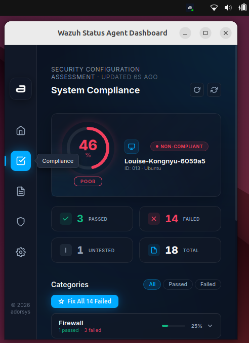
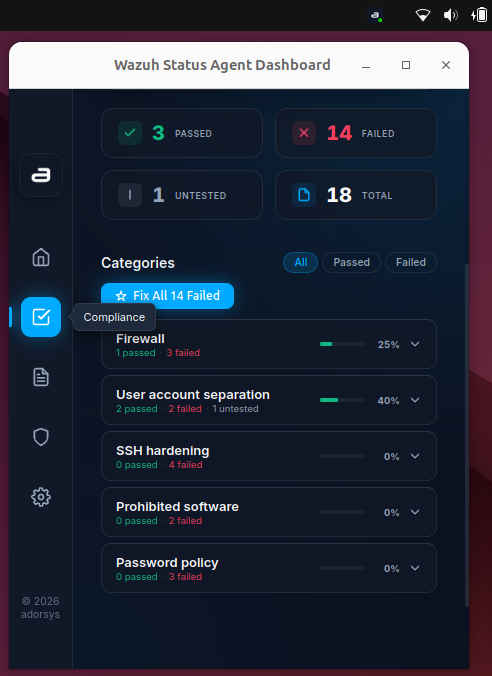

# Compliance Dashboard

## Overview
The Compliance Dashboard provides a visual breakdown of the Security Configuration Assessment (SCA) results for your local system, letting you instantly see which security policies are passing or failing.

## How It Works (Where Do the Checks Come From?)
Wazuh agents run periodic Security Configuration Assessments (SCAs). These checks are not generated randomly; they are driven by **Policy Files** distributed by your Wazuh Manager. 
- These policies are usually based on industry standards, such as the **CIS (Center for Internet Security) Benchmarks**.
- The Wazuh agent scans your system's registry keys, configuration files, and running processes against these strict rules.
- The desktop application fetches the latest SCA results over a secured API connection to the Wazuh Manager, where the compliance data is aggregated and stored.

## Step-by-Step Guide

### 1. Open the Dashboard
- Click the Wazuh Agent Status system tray icon and select **Show Dashboard**.
- Navigate to the **Compliance** tab on the side navigation menu.

### 2. Review the Summary
At the top of the dashboard, you will see a summary of your system's overall compliance score, including:
- Total checks performed
- Number of passed checks
- Number of failed checks

### 3. Understanding the Checks
When you scroll through the list, you will see a variety of individual compliance rules. Here is what they mean:
- **Passed Checks (🟢 Green):** Your system is configured securely according to that specific policy.
- **Failed Checks (🔴 Red):** This highlights a misconfiguration or vulnerability that needs to be fixed.

**Common Check Types:**
- **Firewall Checks:** Verifies that your system's firewall (e.g., Windows Defender Firewall, `ufw`, or `firewalld`) is active and properly configured to block unauthorized inbound connections.
- **User Account Separation:** Ensures that administrative privileges are strictly controlled. This includes checking that default guest accounts are disabled, and that standard users cannot perform sensitive system modifications without elevation.
- **SSH Hardening:** For Unix-based systems, these checks verify that the SSH daemon is securely configured (e.g., ensuring root login is disabled, enforcing SSH keys over passwords, and disabling weak ciphers).
- **Password Policy:** Scans the system's security policies to ensure strong password requirements are enforced, such as minimum password length, complexity, and mandatory password rotation.
- **Prohibited Software Checks:** Scans your installed packages or registry keys to verify that unauthorized, outdated, or known-vulnerable applications (like outdated Java versions or insecure browser plugins) are **not** installed on your machine. If it fails, it means the software was found and should be uninstalled.

### 4. View Remediation Details
Click on any failed check to expand its details. Inside, you will see:
- **Rationale:** Why this configuration is dangerous.
- **Condition:** The exact file, command, or registry key the agent checked.
- **Remediation:** The manual steps to fix it.

From here, you can leverage the [AI Remediation](ai-remediation.md) feature to instantly generate the fix rather than doing it manually.
