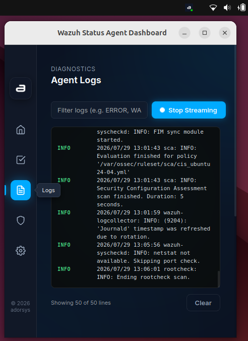

# Real-Time Log Streaming

## Overview
The Real-Time Log Streaming feature allows you to view the local Wazuh agent's logs directly within the desktop dashboard, making it incredibly easy to troubleshoot connectivity issues or monitor active responses without opening a terminal.

## How It Works
The backend Rust server continuously tails the agent's primary log file (`ossec.log`) and the `active-responses.log` file. As new lines are appended to these files by the Wazuh agent, the server pushes them via TCP to the client UI, which renders them in a scrolling console view.

## Step-by-Step Guide

### 1. Open the Logs View
- Click the Wazuh Agent Status system tray icon and select **Show Dashboard**.
- Navigate to the **Logs** tab on the side navigation menu.

### 2. Monitor the Log Stream
You will see a terminal-like window displaying the latest log entries.
- By default, the logs update automatically as new events occur.
- You can see connection attempts to the Wazuh Manager, error messages, and internal agent events.

### 3. Start and Stop Streaming
If the log stream is moving too quickly or you want to pause to read a specific entry:
- Click the **Stop Streaming** button in the UI to pause the incoming stream.
- Click the **Stream Logs** button to reconnect to the server and continue receiving new log events in real-time.

### 4. Filtering and Clearing Logs
- **Filter:** Use the text input at the top of the logs view to instantly filter the stream (e.g., type "ERROR" or "WARNING" to only see those lines).
- **Clear:** Click the **Clear** button at the bottom of the screen to empty the current log view and start fresh.

### 5. Troubleshooting with Logs
If your tray icon is showing a disconnected state ( Red Dot), the log stream is the best place to find out why.
Look for messages such as:
- `ERROR: Could not connect to manager`
- `INFO: Validating server certificate`
- `WARNING: Authentication failed`

### 6. Active Response Logs
If your agent is configured to run active responses (e.g., automatically blocking an IP), you can also see the output of those scripts being executed in real-time within this view.
