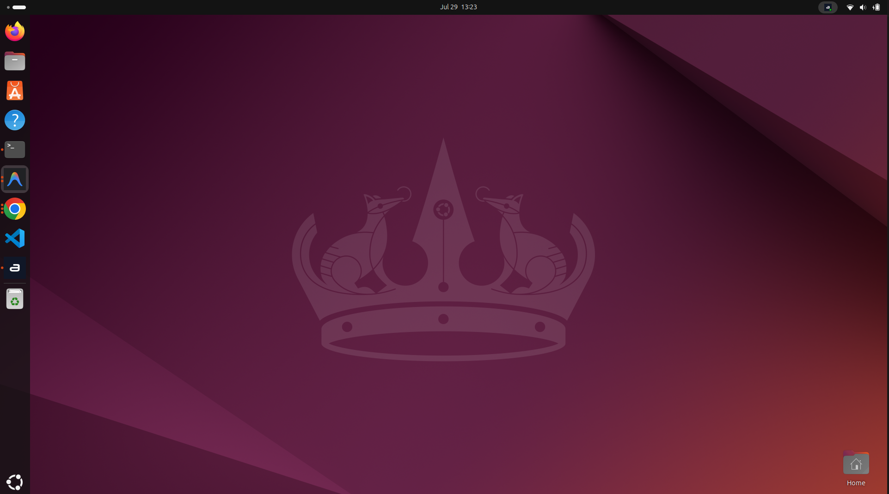
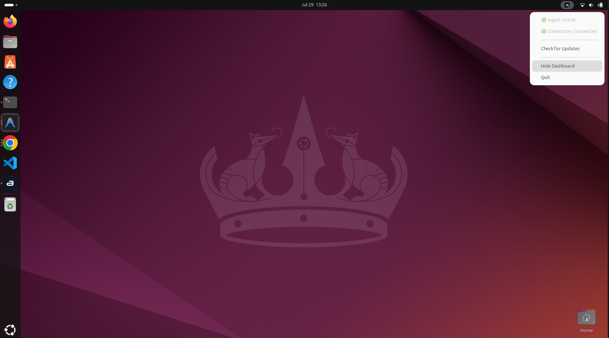

# Real-Time Monitoring & System Tray

## Overview
Wazuh Agent Status continuously tracks the health and connectivity of your local Wazuh agent, displaying its status directly in your operating system's system tray.

## How It Works
The background Rust server polls the agent's internal state file (`wazuh-agentd.state`) and process status every 5 seconds. These updates are streamed over a local TCP connection to the desktop client, which instantly updates the tray icon and menu.

## Step-by-Step Guide

### 1. Understanding the Tray Icon
Look for the Wazuh Agent Status icon in your system tray (bottom-right on Windows/Linux, top-right on macOS). The color of the dot on the icon indicates the agent's status:
- **🟢 Green Dot:** The agent is active and successfully connected to the Wazuh Manager.
- **🔴 Red Dot:** The agent is inactive, stopped, or disconnected from the Wazuh Manager.
- **⚪ Gray Dot:** The agent is in an unknown or transitional state.

### 2. Using the Tray Menu
Click (or right-click) the tray icon to open the quick-action menu.

From here, you can:
- **Check Status:** View the explicit text status of the agent (e.g., "Agent: Active", "Connection: Connected").
- **Check for Updates:** Securely trigger a check for a newer version of the Wazuh Agent Status application.
- **Show Dashboard:** Open the main application interface to view detailed metrics.
- **Quit:** Fully shut down the client application.

