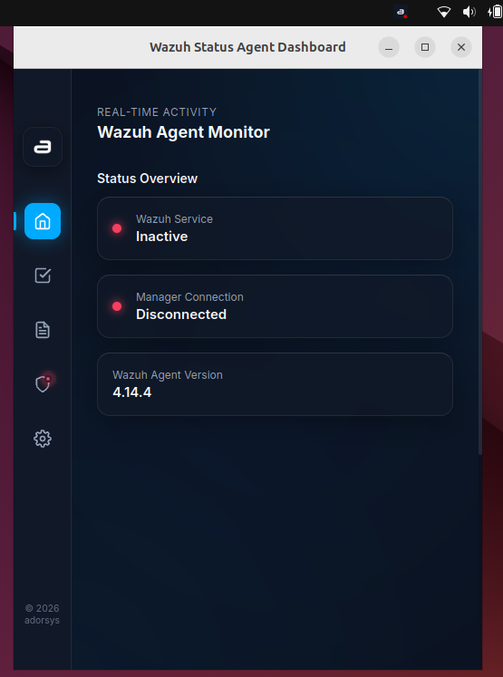
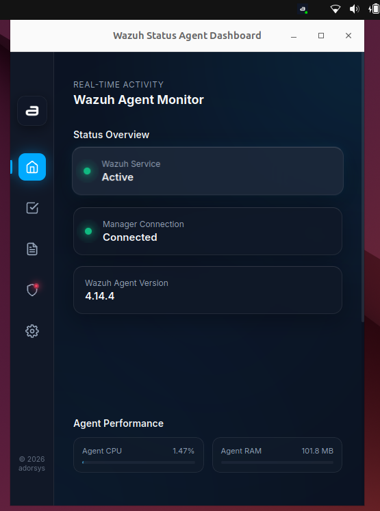

# Self-Healing Capabilities

## Overview
The Self-Healing feature automatically detects if the Wazuh agent has crashed or stopped unexpectedly and attempts to restart it without requiring user intervention.

## How It Works
The privileged Rust server monitors the Wazuh agent's status. If the agent's process terminates unexpectedly (going from an "Active" to an "Inactive" state), the server will automatically issue a system-level command to restart the Wazuh agent service. This behavior is configurable via the `WAZUH_STATUS_SELF_HEALING` environment variable, which defaults to `true`.

## Step-by-Step Guide

### 1. Enabling or Disabling Self-Healing
Self-healing is enabled by default. To disable it:
- Set the `WAZUH_STATUS_SELF_HEALING` environment variable to `false` (or `0`) before starting the server.

### 2. Monitoring Self-Healing Actions
If the Wazuh agent goes offline unexpectedly, you might temporarily see a 🔴 Red Dot on your tray icon.
- The server will immediately attempt to restart the agent.
- If successful, the tray icon will return to a 🟢 Green Dot within a few minutes.

 

### 3. Checking the Logs
You can confirm that a self-healing action took place by checking the log stream:
- Open the **Show Dashboard** menu from the system tray.
- Navigate to the **Logs** tab.
- Look for a log entry indicating that the agent was automatically restarted by the server's watchdog service.
