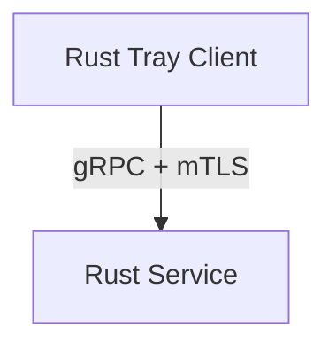

# 🦀 Rust Migration Proposal

## 1. Objective

Define the strategy for migrating the system from Go to Rust to improve performance, security, and maintainability.

---

## 2. Target Architecture

---

## 3. Technology Choices

- Runtime: tokio
- Communication: tonic (gRPC)
- Security: rustls
- Tray UI: tray-icon
- Serialization: serde / protobuf

---

## 4. Migration Strategy

### Step 1

- Replace tray client with Rust
- Keep Go server

### Step 2

- Introduce gRPC interface

### Step 3

- Migrate server to Rust (optional)

---

## 5. Compatibility Strategy

- Maintain TCP support during transition
- Introduce dual-protocol support if needed

---

## 6. Rollback Plan

- Keep Go binaries available
- Use feature flags for switching implementations

---

## 7. Performance Targets

- Client RAM: < 10MB
- Server RAM: < 5MB
- Latency: < 1ms

---

## 8. Risks

| Risk                  | Mitigation         |
| --------------------- | ------------------ |
| Rust complexity       | Training           |
| Async issues          | Use tokio patterns |
| Cross-platform issues | CI matrix builds   |

---
