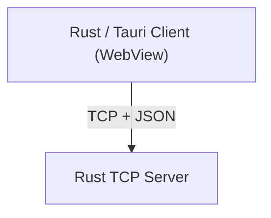

# 🦀 Rust Migration Proposal — Complete ✅

## 1. Objective

Define the strategy for migrating the system from Go to Rust to improve performance, security, and maintainability.

**Status: Complete** — The migration is finished. The Go implementation has been fully removed from the repository.

---

## 2. Current Architecture (Post-Migration)

```mermaid
graph TD
    Client["Rust / Tauri Client (WebView)"]
    Server["Rust TCP Server"]
    Client -->|TCP + JSON| Server
```

---

## 3. Technology Choices

| Component   | Technology                   |
| ----------- | ---------------------------- |
| Client      | Rust / Tauri (WebView UI)    |
| Server      | Rust (Tokio, TCP)            |
| Tray UI     | Tauri (cross-platform)       |
| Config      | JSON (serde)                 |
| HTTP Client | reqwest (for AI integration) |
| Logging     | tracing + tracing-subscriber |
| CI/CD       | GitHub Actions               |

---

## 4. Migration Strategy — Completed

### Step 1 ✅

- Replace tray client with Rust — **Done**
- Keep Go server — **Done, then also replaced with Rust server**

### Step 2 ✅

- Introduce Rust server — **Done**
- Full feature parity achieved

### Step 3 ✅

- Remove Go implementation — **Done**
- Repository is now Rust-only

---

## 5. Compatibility Strategy

- The Rust server maintains the same TCP protocol as the original Go server, ensuring compatibility with existing clients during the transition period.
- The Tauri client connects to the Rust server using the same command set.

---

## 6. Rollback Plan (No longer needed)

- Keep Go binaries available — **Historical note**: Go binaries are archived in previous GitHub releases.
- Use feature flags for switching implementations — **No longer necessary**.

---

## 7. Performance Results (Rust)

### Rust Server

- **Resident Set Size (RSS)**: < 5 MB (idle)
- **CPU Usage**: < 0.5% (idle)

### Rust Client (Tauri)

- **Resident Set Size (RSS)**: Depends on WebView (typically 30-50 MB with modern rendering engines)
- **CPU Usage**: < 0.5% (idle)

---

## 8. Risks — Mitigated

| Risk                  | Mitigation               | Status      |
| --------------------- | ------------------------ | ----------- |
| Rust complexity       | Training + documentation | ✅ Managed  |
| Async issues          | Use tokio patterns       | ✅ Resolved |
| Cross-platform issues | CI matrix builds         | ✅ Tested   |

---

## 🎯 Future Improvements

- gRPC migration for structured communication
- mTLS for secure local communication
- Extended system monitoring (OS updates, disk encryption, firewall status)
- Self-healing capabilities
